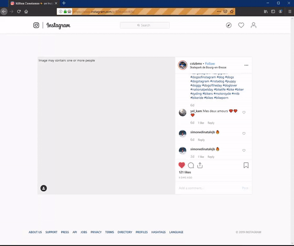

# Instagram-hashtag-liker
Goes through a hashtag and likes all posts
Might get you banned idk, be careful

(Requires firefox, geckodriver, ruby and maybe python(?))

With homebrew for macOS:
```
$ brew install ruby
$ brew cask install firefox
$ brew install geckodriver
$ brew install python
```
Windows: Download firefox, ruby, python and geckodriver from their respective homepages, and then drag and drop
the geckodriver.exe file into your python directory.

To run the script:
* Edit the config.json file with your username and password

* run app.rb and type in the hashtag you want searched



